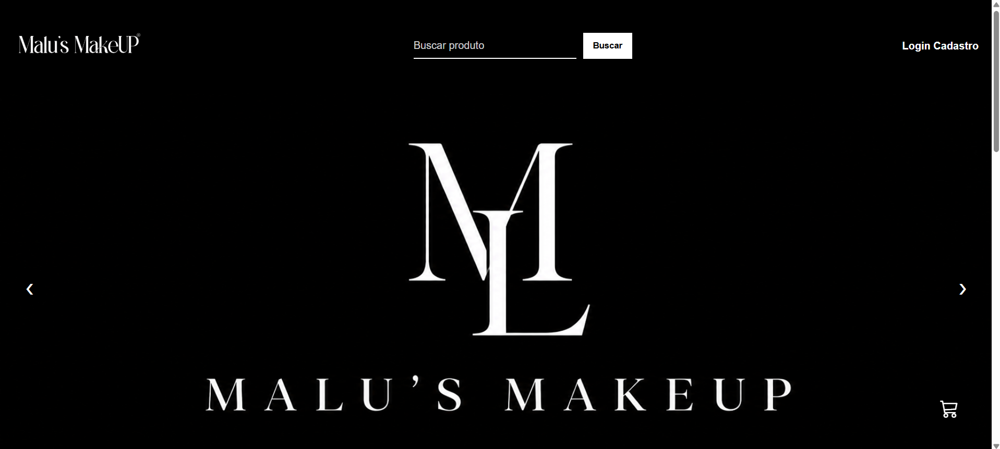
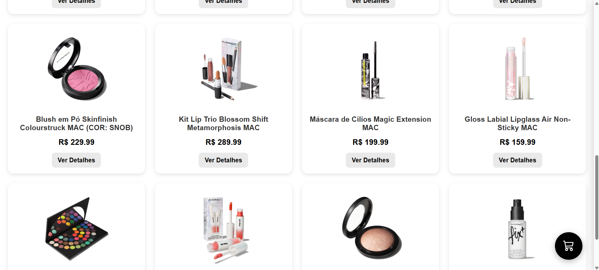
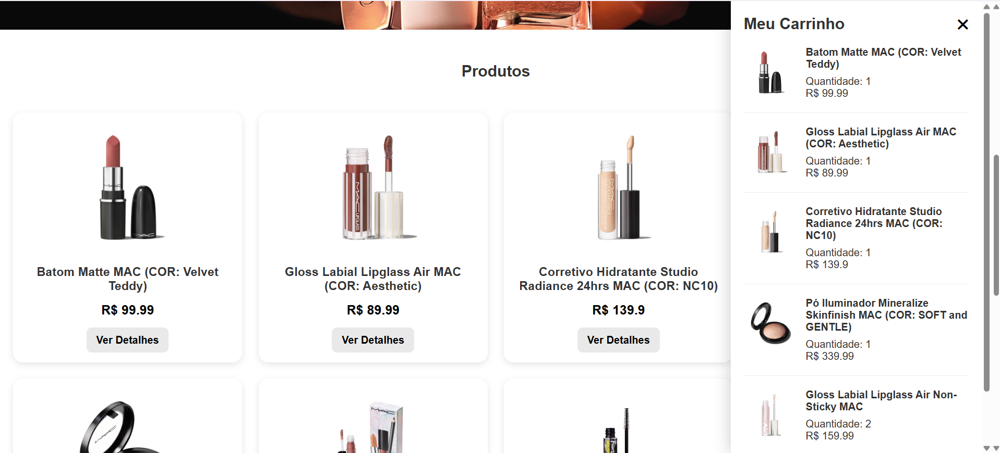
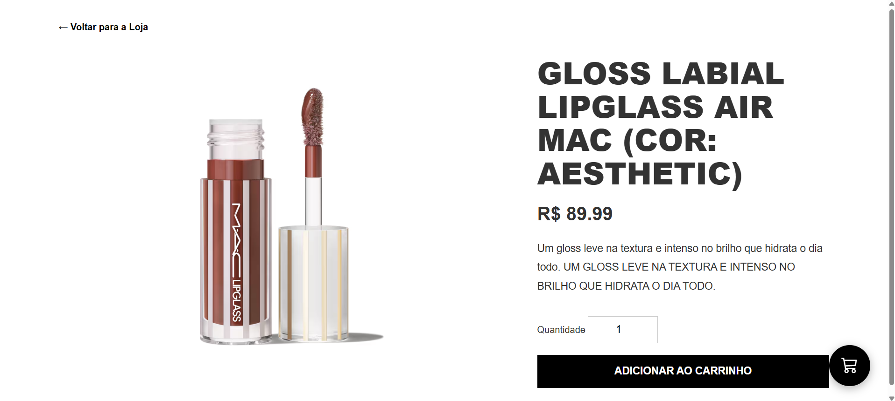

# 💄 Projeto Loja Makeup

Uma loja virtual desenvolvida como projeto final da disciplina **Fundamentos de Programação para Web**. O sistema permite o cadastro e gerenciamento de produtos de maquiagem, oferecendo uma interface intuitiva para navegação e administração da loja.

## 📷 Demonstração
### Página inicial




### Catálogo de produtos





### Detalhes de produtos



## ✨ Funcionalidades

- Cadastro de produtos
- Listagem de produtos
- Edição de produtos
- Exclusão de produtos
- Visualização dos detalhes dos produtos
- Interface responsiva
- Integração com banco de dados MariaDB/MySQL

## 🛠️ Tecnologias utilizadas

- Java
- Spring Boot
- Spring MVC
- Thymeleaf
- HTML5
- CSS3
- JavaScript
- MariaDB / MySQL
- Maven

## 🚀 Como executar

1. Clone o repositório:

```bash
git clone https://github.com/SEU-USUARIO/projeto-loja.git
```

2. Entre na pasta:

```bash
cd projeto-loja
```

3. Configure o banco de dados no arquivo:

```text
src/main/resources/application.properties
```

4. Execute o projeto:

```bash
./mvnw spring-boot:run
```

ou no Windows:

```bash
mvnw.cmd spring-boot:run
```

5. Acesse:

```text
http://localhost:8080
```

## 👥 Desenvolvido por

- Luiz Fernando de Carvalho Teixeira (@luiz015)
- Maria Eduarda da Silva Leme (@leme04maria06)

Projeto desenvolvido como trabalho acadêmico do IFSP.
